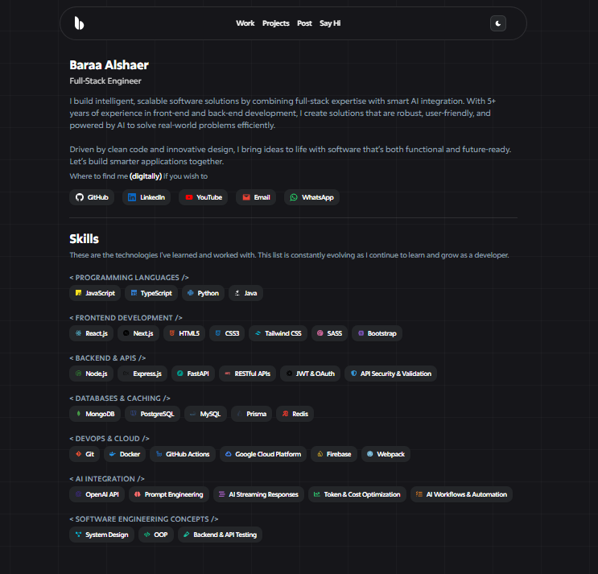

# blshaer-website (Portfolio)

A modern, high-performance portfolio website built with **Next.js**, **TypeScript**, and **Tailwind CSS**.

---

---

## Getting Started

To get this project up and running locally, follow the steps below:

### 1. Clone the Repository

```bash
git clone https://github.com/blshaer/blshaer-website.git
cd blshaer-website
```

### 2. Install Dependencies

```bash
npm install
```

### 3. Run the Development Server

```bash
npm run dev
```

Once the development server is running, open [http://localhost:7000](http://localhost:7000) in your browser to view the site.

---

## Features

- **Static Export**: Deployable anywhere without requiring a server.
- **Responsive Design**: Optimized for all devices and screen sizes.
- **Dark/Light Theme**: Automatically adjusts based on system preferences.
- **Performance Optimized**: Built with speed and SEO in mind.
- **Email Integration**: Contact form functionality powered by **EmailJS**.

---

## Tech Stack

- **[Next.js](https://nextjs.org/)** - React framework for server-side rendering and static site generation.
- **[TypeScript](https://www.typescriptlang.org/)** - Type-safe JavaScript for better maintainability.
- **[Tailwind CSS](https://tailwindcss.com/)** - Utility-first CSS framework for faster UI development.
- **[Framer Motion](https://www.framer.com/motion/)** - Library for high-performance animations.
- **[Radix UI](https://www.radix-ui.com/)** - Set of accessible and customizable UI components.
- **[Lucide React](https://lucide.dev/)** - A collection of customizable, high-quality icons.

---

## Project Structure

```
src/
├── app/                    # Main app directory for Next.js routing and pages
├── features/               # Feature modules that contain individual sections of the portfolio
│   ├── projects/           # Portfolio projects section
│   ├── blog/               # Blog posts (if applicable)
│   └── contact/            # Contact form section
├── layouts/                # Layout components (e.g., header, footer, main layout)
├── shared/                 
│   ├── ui/                 # Reusable UI components
│   ├── lib/                # Utility functions and helpers
│   └── data/               # Static data like personal info, projects, experiences, etc.
└── styles/                 # Global styles and Tailwind configurations
```

---

## Configuration

### Environment Variables

To enable email functionality for the contact form, create a `.env.local` file and include the following:

```env
NEXT_PUBLIC_EMAILJS_SERVICE_ID=your_service_id
NEXT_PUBLIC_EMAILJS_TEMPLATE_ID=your_template_id
NEXT_PUBLIC_EMAILJS_USER_ID=your_user_id
```

### Customizing Your Portfolio

To personalize the content in your portfolio, modify the following files:

- **`src/shared/data/Profile.ts`** - Personal information (name, bio, etc.).
- **`src/shared/data/Experiences.ts`** - Your work experience and career history.
- **`src/shared/data/Projects.ts`** - Details of your portfolio projects.

---

## Build & Deploy

### Production Build

To create a production build of the website, run:

```bash
npm run build
```

This will generate an optimized static export in the `out/` directory.

### Deployment Options

#### Vercel (Recommended)

For an easy deployment experience, you can deploy the site directly to [Vercel](https://vercel.com/) with:

```bash
npm run deploy
```

#### Netlify

1. Set the **Build Command** to `npm run build`.
2. Set the **Publish Directory** to `out`.

#### GitHub Pages

1. Build the site: `npm run build`.
2. Push the contents of the `out/` directory to your `gh-pages` branch.

---

## Contact

For inquiries, please reach out via [GitHub](https://github.com/blshaer) or [LinkedIn](https://www.linkedin.com/in/blshaer/).

---
